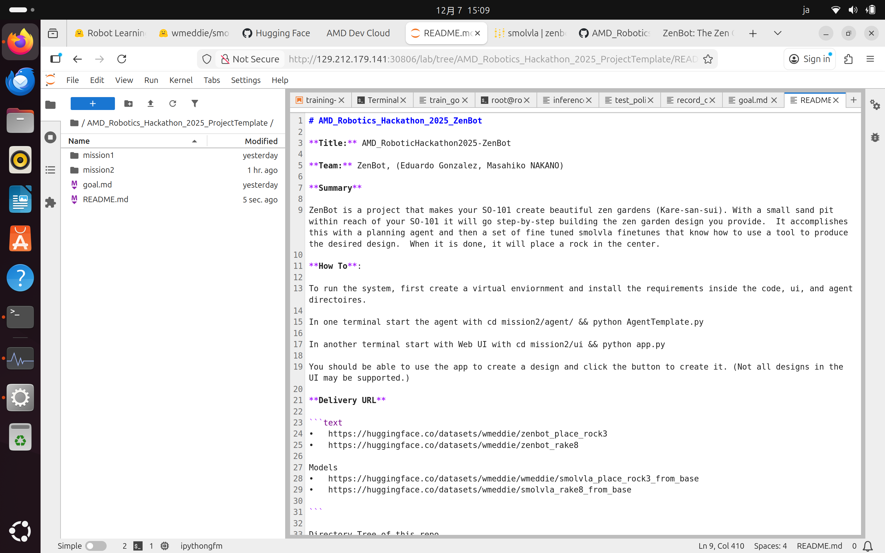
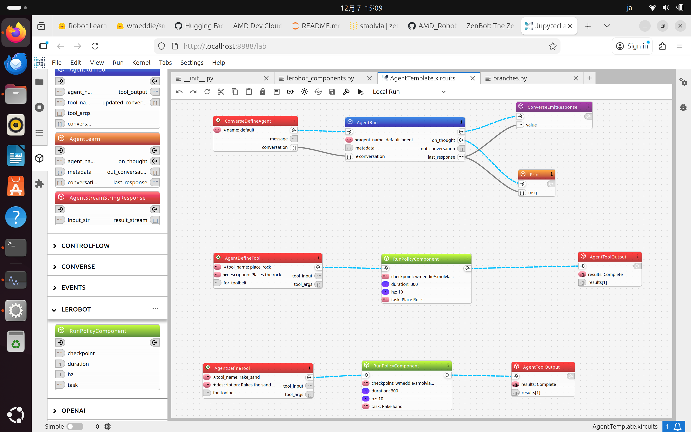

# AMD_Robotics_Hackathon_2025_ZenBot

**Title:** AMD_RoboticHackathon2025-ZenBot

**Team:** ZenBot, (Eduardo Gonzalez, Masahiko NAKANO)

## Summary

ZenBot is a project that makes your SO-101 create beautiful zen gardens (Kare-san-sui). With a small sand pit within reach of your SO-101 it will go step-by-step building the zen garden design you provide. It accomplishes this with a planning agent and then a set of fine tuned SmolVLA models that know how to use tools to produce the desired design. When it is done, it will place a rock in the center.



## Architecture

The system consists of three main components:

1. **Web UI** - A Flask-based interface for designing zen gardens
2. **Planning Agent** - An LLM-powered agent that orchestrates the robot actions
3. **SmolVLA Policies** - Fine-tuned vision-language-action models for specific skills (rake, place rock)



## How To Run

To run the system, first create a virtual environment and install the requirements inside the code, ui, and agent directories.

### 1. Start the Planning Agent
```bash
cd mission2/agent/
python AgentTemplate.py
```

### 2. Start the Web UI
```bash
cd mission2/ui
pip install flask requests
python app.py
```

### 3. Run a Policy Directly (Optional)
```bash
cd mission2/code
python test_policy.py --checkpoint wmeddie/smolvla_rake8 --max-speed 10
```

You should be able to use the app to create a design and click the button to create it. (Not all designs in the UI may be supported.)

## Training

We fine-tuned SmolVLA from `lerobot/smolvla_base` (pretrained on 10M frames of community robot data) using the LeRobot framework on AMD MI300X GPUs.

Key training insights from the [SmolVLA paper](https://huggingface.co/blog/smolvla):
- Fine-tuning from pretrained base improves success rate by ~27%
- Used `--policy.empty_cameras=1` for 2-camera setup
- Camera rename mapping: `front→camera1`, `top→camera2`

Training command example:
```bash
lerobot-train \
  --policy.path=lerobot/smolvla_base \
  --policy.repo_id=wmeddie/smolvla_rake8 \
  --policy.empty_cameras=1 \
  --dataset.repo_id=wmeddie/zenbot_rake8 \
  --batch_size=8 \
  --num_workers=8 \
  --steps=20000 \
  --rename_map='{"observation.images.front": "observation.images.camera1", "observation.images.top": "observation.images.camera2"}'
```

## Datasets & Models

**Datasets (HuggingFace)**
- https://huggingface.co/datasets/wmeddie/zenbot_place_rock3
- https://huggingface.co/datasets/wmeddie/zenbot_rake8

**Models (HuggingFace)**
- https://huggingface.co/wmeddie/smolvla_place_rock3
- https://huggingface.co/wmeddie/smolvla_rake8

## Directory Structure

```
AMD_Robotics_Hackathon_2025_ProjectTemplate/
├── README.md
├── agent.png
├── ui.png
├── mission1/
│   ├── code/
│   └── wandb/
└── mission2/
    ├── agent/          # Xircuits-based planning agent
    ├── code/           # Training scripts, policies, test code
    │   ├── test_policy.py
    │   ├── record_demonstrations.py
    │   ├── replay_demo.py
    │   └── outputs/    # Training outputs with wandb logs
    └── ui/             # Flask web interface
        ├── app.py
        ├── templates/
        └── static/
```

## WandB Training Logs

Training runs are logged to WandB under project `zenbot`:
- `smolvla_place_rock3_from_base` - Place rock skill (50 episodes)
- `smolvla_rake8_from_base` - Rake skill (25 episodes)

## Hardware

- **Training**: AMD MI300X GPU
- **Robot**: SO-101 follower arm with SO-101 leader for teleoperation
- **Cameras**: 2x USB cameras (front/arm view, overhead view)
